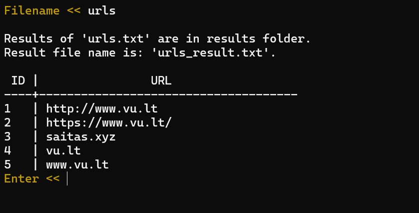

## Description
This program scans and analyzes text files. It finds all the unique words, counts how 
many times each word appears, and notes where they are located in the text. It also identifies
 any URL addresses present in the files.

## Instruction

1. To begin, run the program and type `file` to access the file selection feature.
2. You will see a list of available .txt files. From this list, enter the exact name
 of the file you wish to scan for data analysis. (If you forget, **.txt** will be added by the program)   

3. If you would like to scan another file, simply enter its name again. If you wish to exit the
 program, type `end` to terminate the process.

Make sure to place all your data files in the designated **data** folder to ensure the program can
 locate them. Once the scanning is complete, the results will be saved in the **results** folder. 
 If you're using the program for the first time, you might need to create these folders yourself.
  Alternatively, you can just launch the program, and it will automatically create both folders for you.

The program will show the results in a simple table format:

| word | count | location |
|--|--|--|
about         | 2    |  47 55 
active          | 2    |  46 48 
advertisers      | 2    |  87 89 
became       | 3    |  20 23 87 
been         | 2    |  62 70 

## About the program
